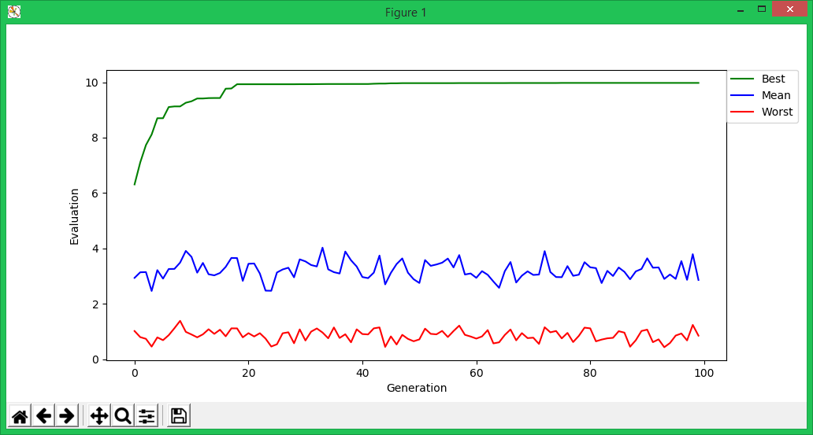

# Canonical-Genetic-Algorithm
Canonical Genetic Algorithm (CGA) with Python

# Parameters

meu = Number of people

L = Gene length

pm = Probability of Mutate

pc = Probability of Crossover

max_gen = Maximum generation

FB = Best Fitness

FW = Worst Fitness

FM = Mean Fitness

# Example of output

